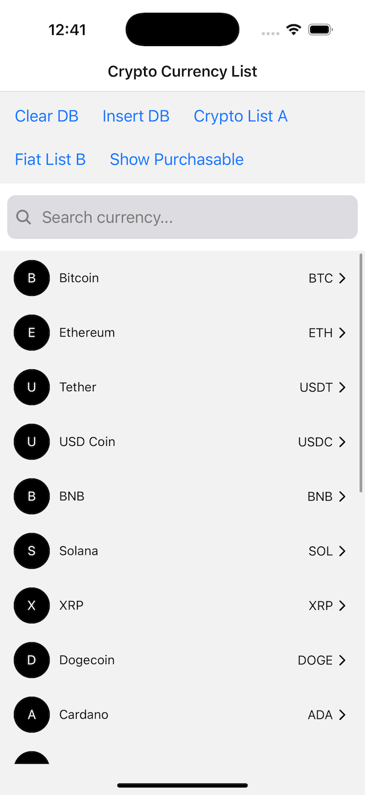
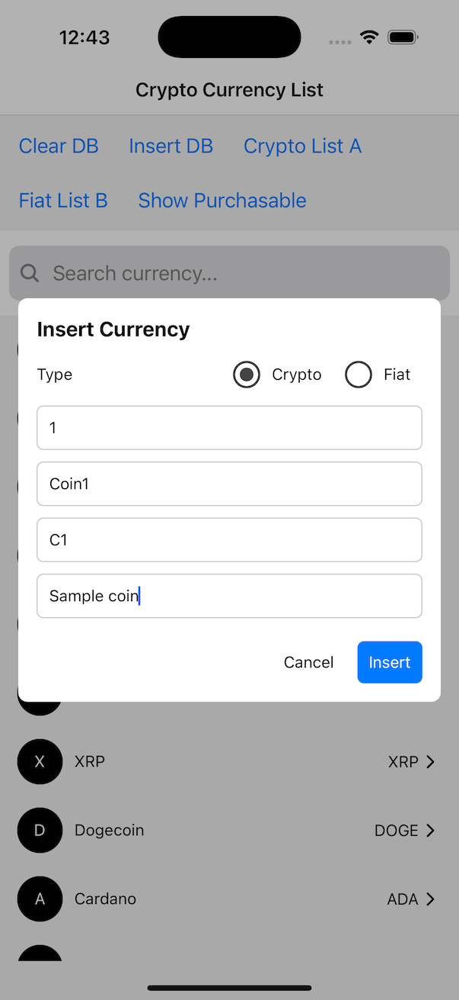

# React Native Crypto List Demo

Crypto & Fiat List demo application using React Native 0.78.2, React 19.0.0, react-navigation v7, jotai & react-native-sqlite-storage v6, core features:<br />

- Load data from sqlite db when app start
- A list to display available crypto & fiat
- Platform specific search bar to query crypto or fiat
- Clear DB: will clear all data from sqlite, it will be fetched again upon restart
- Insert DB: insert a row of data to sqlite and display it on the list (crypto or fiat)
- Crypto List A: display list of available crypto
- Fiat List B: display list of available fiat
- Show purchasable: display list of purchasable items

<br />Screenshots<br /><br />

<br /><br />

Try it out at<br />
https://drive.google.com/file/d/1WK7qYhdwHkfEyoqcQhyKjLkjeAhgisHe/view?usp=drive_link

Setup project:

```
git clone https://github.com/Dat-Mobile/CryptoListAssignment.git

cd CryptoListAssignment && yarn
```

Make sure SDK Enviroment is setup properly and run:

```
yarn android
or
yarn ios
```
